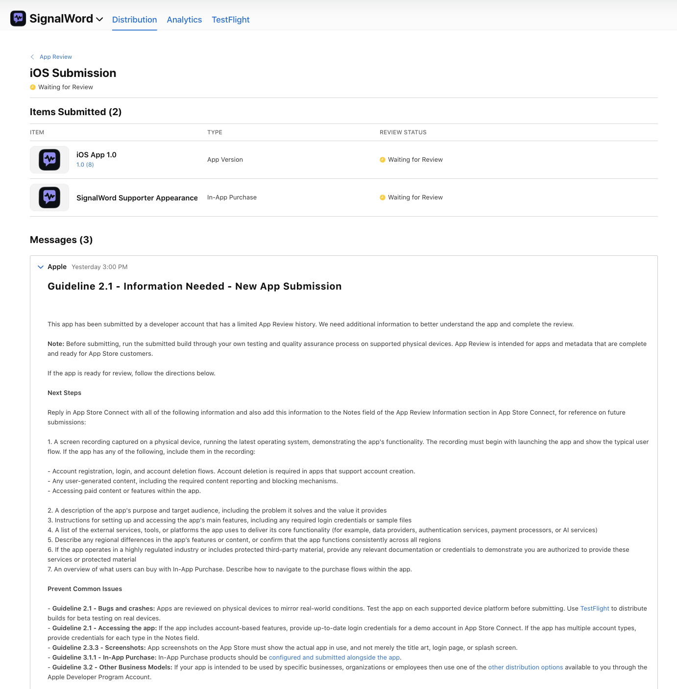

# Submission assets

- [1024×1024 app icon](app-icon-1024.png), copied from the native app asset catalog.
- [1024×1024 brand icon](brand-icon-1024.png), owner-provided and displayed in the main README.
- [Understand/setup preview — 1179×2556](understand-setup-1179x2556.png), prepared from the owner-provided 1284×2778 image. Its proportions are preserved with five pixels of background padding in total. Only sizing and padding were changed; UI content was not redrawn.
- [Supporter appearance screenshot](supporter-appearance-original.png): original owner-supplied app screenshot, 728×1446. It shows both themes, Restore purchases and Refresh purchase status. Supplemental gallery material; it does not meet the required 1179×2556 dimensions.
- Apple review submission screenshot below: supplemental evidence only.

## Apple review submission evidence

Owner-supplied App Store Connect screenshot captured **2 October 2026 at 02:13 Sydney time (UTC+10)**. This is an unmodified copy of the supplied screenshot; it shows:

- iOS App 1.0 (8): Waiting for Review.
- SignalWord Supporter Appearance: Waiting for Review.
- Apple's earlier Guideline 2.1 — Information Needed — New App Submission message, requesting a physical-device demonstration and additional explanations because the developer account has limited App Review history.

That message does not identify a specific crash or functional failure. It also does not certify that the build has passed technical review. These are review-submission records, **not approval or a public App Store release**, and do not replace Shipaton's store-listing or required app-screenshot deliverables.

The original submission was October 1 at 04:16 Sydney (September 30 at 18:16 UTC / 11:16 PDT); the same Build 8 was resubmitted October 2 at 01:33 Sydney. The supporting Apple history screenshot and original confirmation email are retained privately because they contain personal account details and email headers.

This folder contains only selected evidence suitable for public sharing. Private originals, internal documents and correspondence remain outside tracked Git files.
